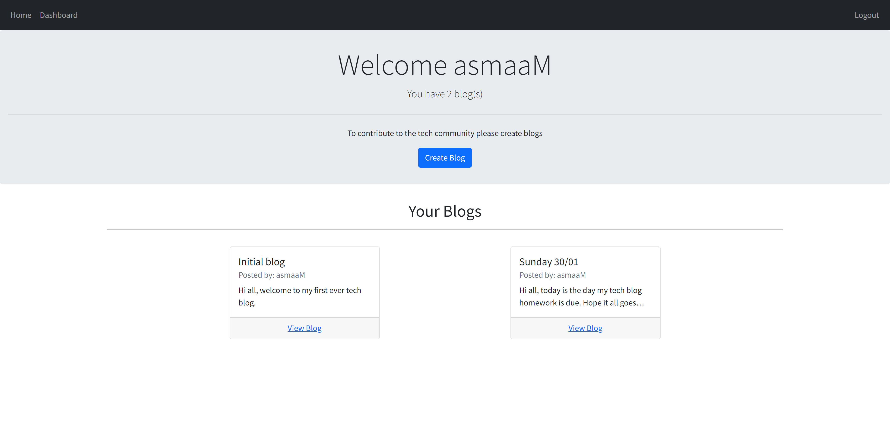
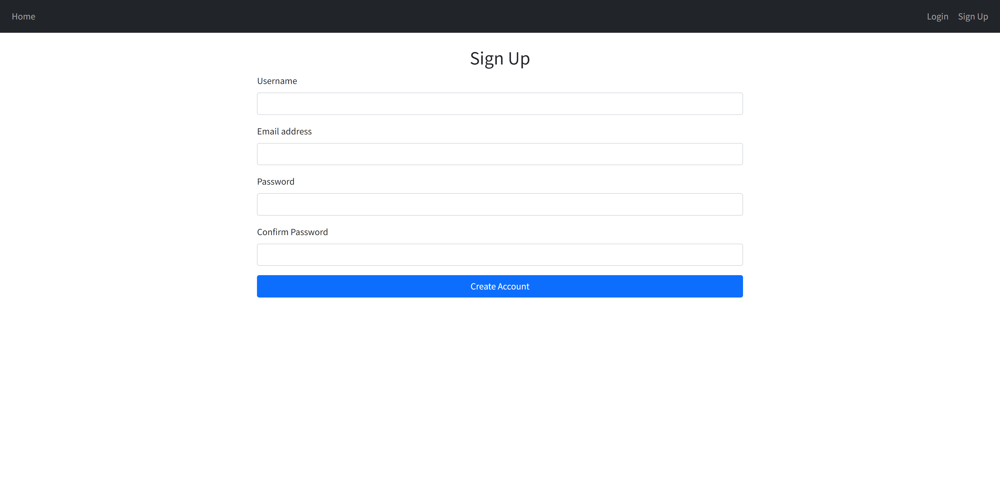

# MVC-blog 

## Description:

For this project, my aim was to build a CMS-style blog site similar to a Wordpress site, where developers can publish their blog posts and comment on other developers’ posts as well.

## Links:

Deployed app: https://tech-blog-m.herokuapp.com/

Github: https://github.com/AsmaaMusse/mvc-blog/tree/dev

## Technologies Used:

- Html/CSS
- Javascript
- Node.js
- Express
- Sequelize
- MVC

## Usage:

### Installation

```
git@github.com:AsmaaMusse/mvc-blog.git
cd mvc-blog
npm install / npm i
```

### Start

```
npm run start
```

### Seed

This application does not require seeding.

## Screenshots:




